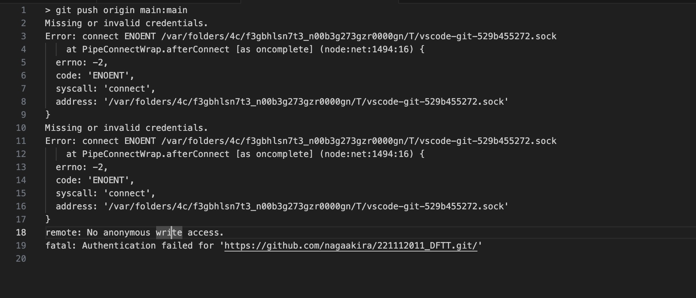
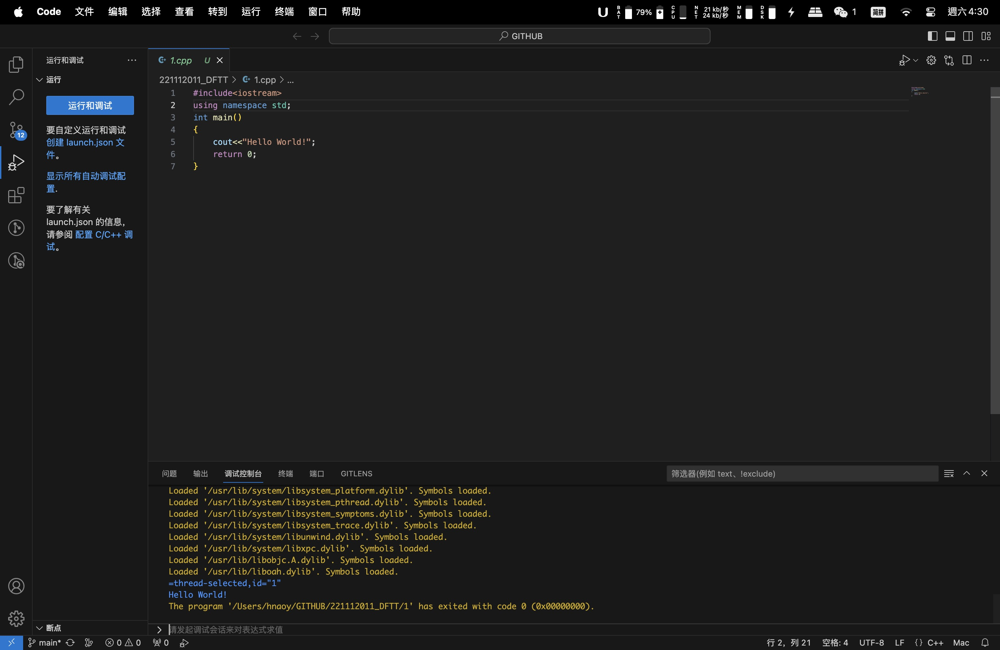
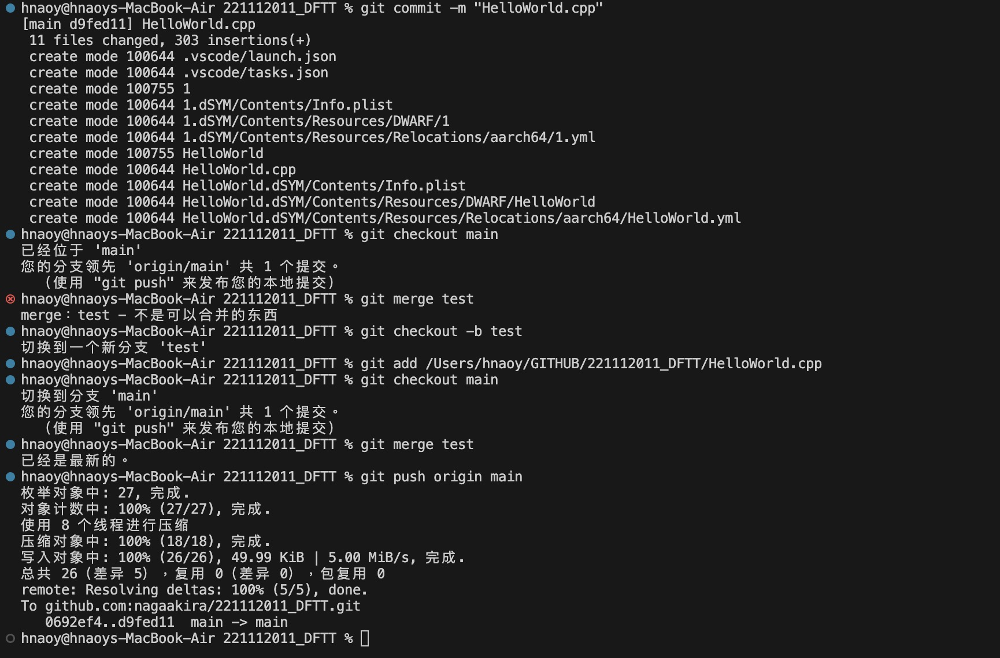

# 闫皓_221112011_作业1

## 个人链接

Github：<https://github.com/nagaakira>

课程 Repo：<https://github.com/nagaakira/221112011_DFTT>

## 作业内容

创建了个人 GitHub 账号，开通了远程仓库并添加 README.md 文件

使用 homebrew 下载 git 并且与 VScode 链接

在 macOS 14.0 sonoma 下使用 VScode 通过 SSH 密钥链接 GitHub Repo

编写 HelloWorld.cpp 程序

完成暂存(add)、提交 (commit)、新建分支(branch)、切换分支(checkout)、合并 (merge)操作并使用 Visual Studio Code 的终端命令将程序上传(push)至 Repo

